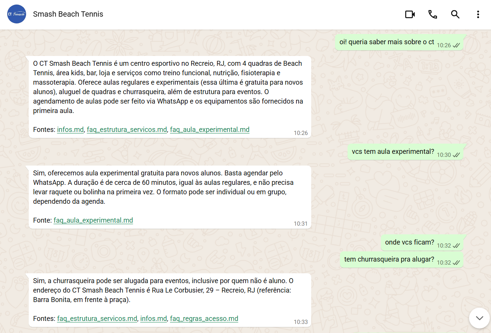
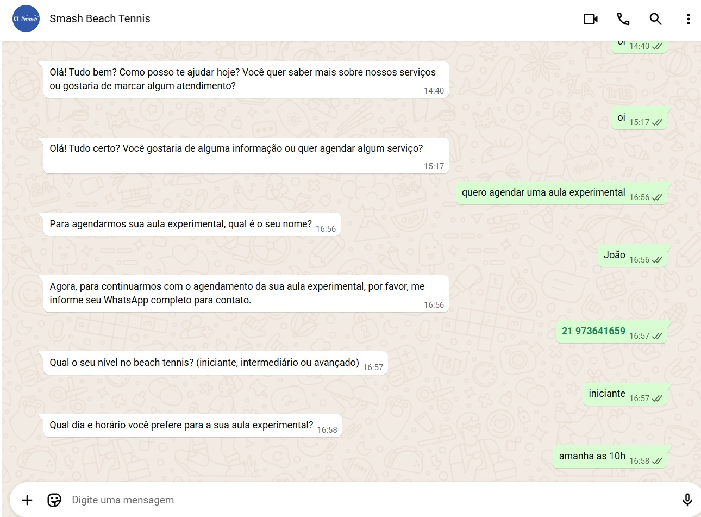

# 🤖 Smash Beach Tennis – AtendentePro 
### ⚠️ Projeto em desenvolvimento (MVP)

Assistente de atendimento para o CT Smash Beach Tennis, baseado no framework **AtendentePro**.

Este projeto implementa um atendente virtual inteligente para um Centro de Treinamento (CT), com o objetivo de substituir o atendimento humano de primeiro nível, automatizando dúvidas frequentes e o agendamento de serviços, utilizando um framework de agentes.

### 🧠 Capacidades do Agente
#### 📝 FAQ
Responder qualquer tipo de pergunta sobre o CT, como local, horários, planos, infos sobre estrutura e serviços etc

#### 🎾 Agendmaneto de Aula Experimental
Agendar aulas experimentais gratuitas com informações mínimas necessárias e registrar/notificar o registro

#### ➕ Agendamento de Outros Serviços 
O CT possui serviços pagos pra alunos matriculados, como Fisioterapia, e serviços pagos pra alunos não matriculados, como aluguel de quadras.
Nesses casos, de serviços pagos, o agente deve ser capaz de escalar a conversa pra um funcionário real, de maneira que notifique o usuário que 
um humano assumirá a conversa em breve. 

## 🧩 Arquitetura Multiagente
Triage (router) direciona a conversa para:
1.  **Flow Agent**: sugere tópicos possíveis e caminhos de atendimento.
2.  **Knowledge Agent**: responde dúvidas do CT usando RAG (embedding combinado dos docs `.md`).
3.  **Interview Agent**: coleta dados para aula experimental.
4.  **Escalation Agent**: chama humano pra registrar pedidos que exigem pagamento (ex.: aluguel de quadra/churrasqueira). Usa horário 11h–19h (env).

## Estrutura do Projeto
- `beachbot/main_cli.py`: chat via terminal (usa o mesmo handler do webhook).
- `beachbot/webhook/server.py`: FastAPI com `/webhook` (Evolution API).
- `beachbot/core/handler.py`: orquestra parser, buffer de 15s, agentes e persistência.
- `beachbot/storage/db.py`: modelos SQLAlchemy (Postgres) e helpers.
- `alembic/`: migrations do Postgres.
- `beachbot/config/*.yaml`: prompts e guardrails dos agentes.
- `beachbot/knowledge/`: base de conhecimento + embeddings em `knowledge/embeddings/ct_combined.pkl`.
- `beachbot/scripts/build_embeddings.py`: geração de embeddings (text-embedding-3-large).
- `docker-compose.yml` e `dockerfile`: suporte a deploy com Evolution API + Postgres.

## 📱 Canal WhatsApp em produção
- Número do WhatsApp Business em nuvem: **+55 21 3955-3825**.
- Usado para testes/operação do bot via Evolution API.
- Configure o webhook da Evolution para o endpoint público do bot para receber mensagens nesse número.

## Documentação
- [Deploy em VPS (produção)](docs/DEPLOY_VPS.md)
- [Rodando o CLI local](docs/CLI_LOCAL.md)
- [Roadmap](docs/ROADMAP.md)
